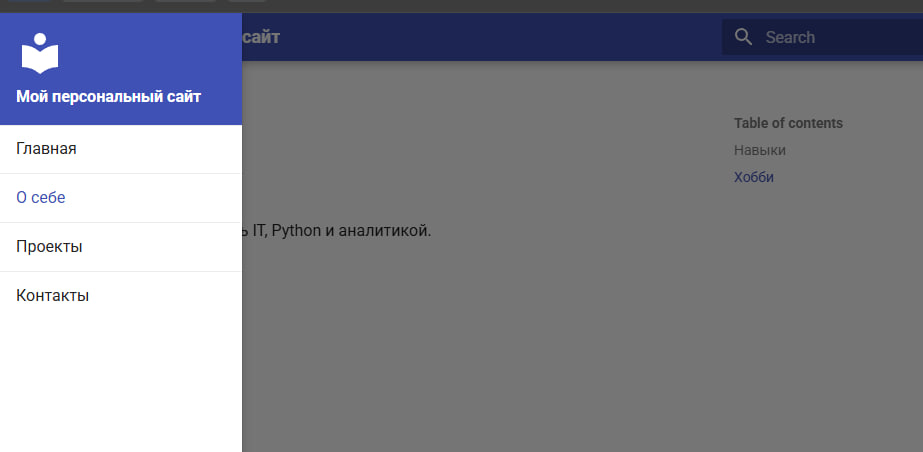
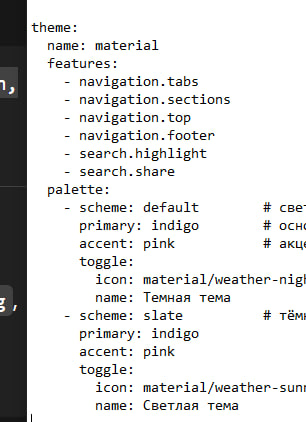

University: [ITMO University](https://itmo.ru/ru/)
Faculty: [FICT](https://fict.itmo.ru)
Course: [Cloud platforms as the basis of technology entrepreneurship](https://) ADD link
Year: 2025/2026
Group: U4225
Author: Budaev Alexandr Sayanovich
Lab: Курсовая работа
Date of create: 12.10.2025
Date of finished: 12.10.2025 

1. Цель работы

Создать персональный сайт с использованием технологии MkDocs и темы Material, научиться структурировать и оформлять информацию с помощью языка разметки Markdown, а также освоить процесс сборки и локального запуска статического сайта.

2. Описание технологии

MkDocs — это генератор статических сайтов, созданный для документирования проектов.
Он позволяет создавать красивые сайты из простых текстовых файлов Markdown.
Material for MkDocs — это современная тема оформления, включающая множество готовых компонентов, поиск, переключение тем и навигацию.

3. Ход работы

Этап 1. Подготовка и установка

- Установлен Python.

- Установлен MkDocs и тема Material:

pip install mkdocs mkdocs-material

- Проверена установка: 
mkdocs --version

- Создан новый проект:

mkdir my-personal-site

cd my-personal-site
mkdocs new .

- Изучена структура проекта:

mkdocs.yml        # файл конфигурации

docs/
    index.md      # главная страница

Этап 2. Настройка конфигурации

Открыт и отредактирован файл mkdocs.yml.
Добавлены название сайта, описание, автор и подключена тема Material.

Пример содержимого:

Этап 3. Создание контента

Созданы страницы:
Добавлено содержимое с использованием элементов Markdown:

заголовки разных уровней (#, ##, ###)

списки

таблицы

ссылки

изображения

цитаты

Этап 4. Дополнительные страницы и контент

Созданы страницы:New-Item resume.md
New-Item achievements.md

Добавлены разделы:

Резюме — образование, навыки, опыт работы

Достижения — учебные, спортивные и личные успехи

Навигация обновлена:
nav:
  - Главная: index.md
  - О себе: about.md
  - Проекты: projects.md
  - Контакты: contacts.md
  - Резюме: resume.md
  - Достижения: achievements.md

Этап 5. Стилизация и кастомизация
Цветовая схема

Логотип и фавикон
Файлы добавлены в docs/images/

Футер и соцсети

естирование и публикация
Локальное тестирование
Результат:
Сайт успешно отображается по адресу
http://127.0.0.1:8000/
Проверена корректность отображения всех страниц и ссылок.

Сборка
Создана папка site/ со статическими HTML-файлами.

4. Результаты работы

Создан персональный сайт на MkDocs + Material

Настроена навигация и структура страниц

Использованы элементы Markdown

Настроены цветовая схема, логотип и футер

Сайт успешно протестирован и собран в статическую версию

5. Вывод

В ходе выполнения курсовой работы я:

Освоил базовые принципы работы с MkDocs

Научился использовать Markdown для оформления контента

Настроил тему Material и кастомизацию внешнего вида

Получил готовый персональный сайт, который можно использовать как портфолио

Результат соответствует требованиям задания.