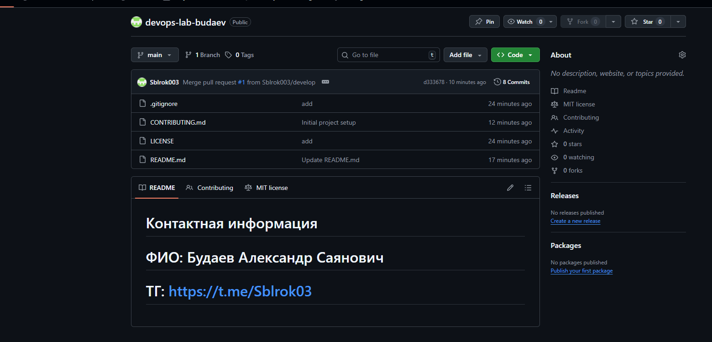

University: [ITMO University](https://itmo.ru/ru/)
Faculty: [FICT](https://fict.itmo.ru)
Course: [Cloud platforms as the basis of technology entrepreneurship](https://) ADD link
Year: 2025/2026
Group: U4225
Author: Budaev Alexandr Sayanovich
Lab: Lab0
Date of create: 29.09.2025
Date of finished: 30.09.2025

# ОПИСАНИЕ РАБОТЫ

### В этой лабораторной работе я создал репозиторий и настроил базовые файлы проекта. Далее создал новую ветку и файл, который смержил в основную ветку мэин. Затем удилил ветку develop

# РЕЗУЛЬТАТЫ

### Создал репозиторий, настроил окружение и написал отчет

