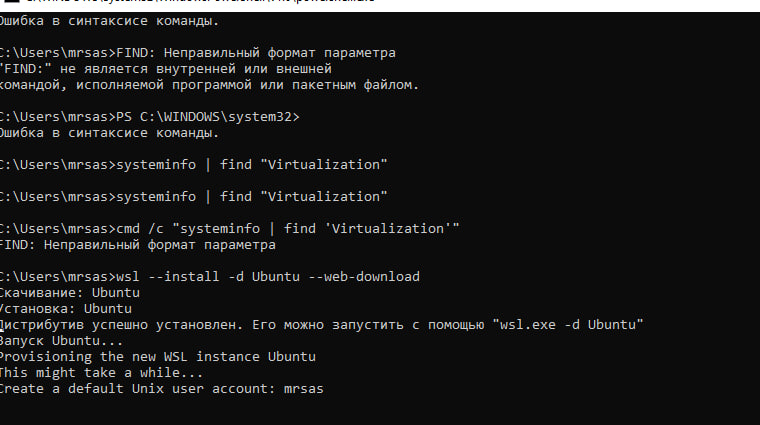
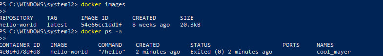
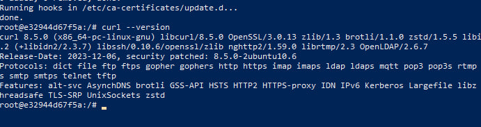
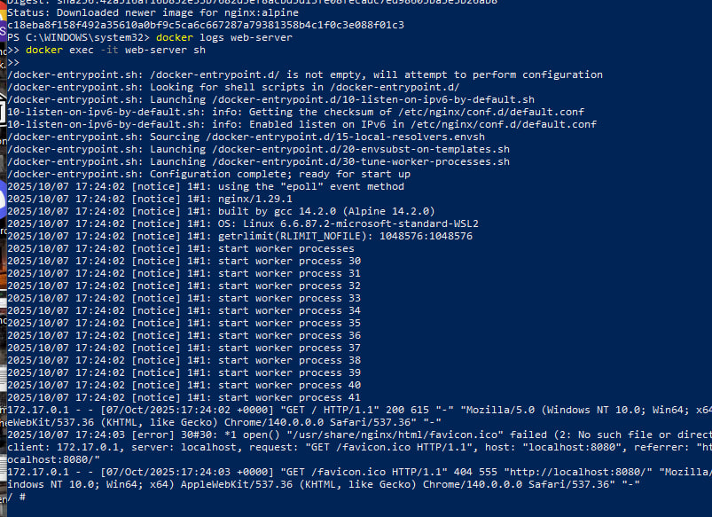
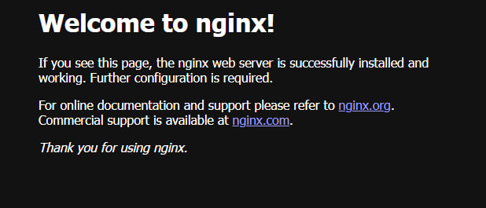
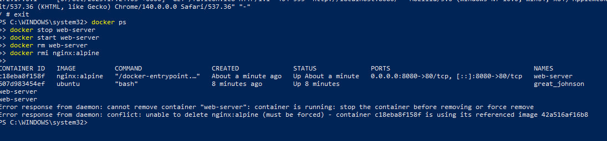
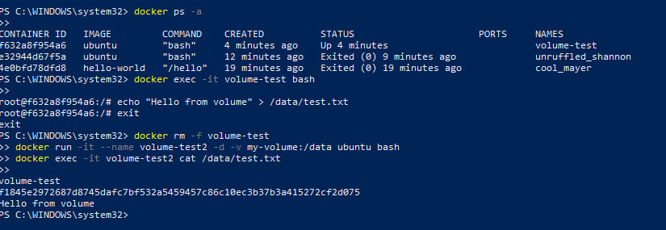
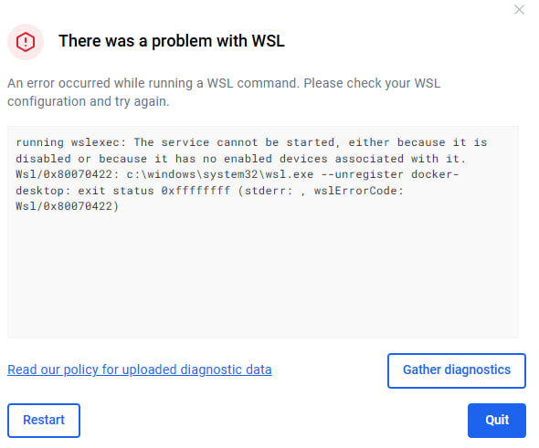

University: [ITMO University](https://itmo.ru/ru/)
Faculty: [FICT](https://fict.itmo.ru)
Course: [Cloud platforms as the basis of technology entrepreneurship](https://) ADD link
Year: 2025/2026
Group: U4225
Author: Budaev Alexandr Sayanovich
Lab: Lab1
Date of create: 07.10.2025
Date of finished: 07.10.2025

Цель работы:
Освоить базовые принципы работы с системой контейнеризации Docker — установку, запуск, управление контейнерами и образами.

Ход работы:
Был установлен и настроен Docker Desktop с поддержкой WSL2. Проверена его работоспособность.
Запущен тестовый контейнер для проверки установки. Изучены основные команды Docker для просмотра образов и контейнеров.
Скачан и запущен образ Ubuntu, внутри которого произведена установка дополнительных пакетов.
Далее был запущен веб-сервер Nginx в контейнере, проверена его работа через браузер и выполнено управление контейнером (остановка, запуск, удаление).
Также проведён эксперимент с томами — создан и подключён том, проверено, что данные сохраняются после пересоздания контейнера.

Сложности, которые были

Результаты:
В ходе лабораторной работы были получены практические навыки использования Docker, изучены основные команды и принципы работы с контейнерами, образами и томами.

Вывод:
Цель лабораторной выполнена — Docker установлен и освоен на базовом уровне.