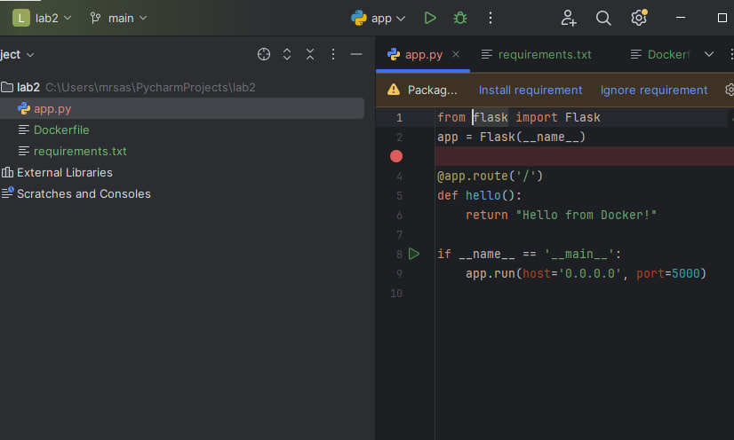
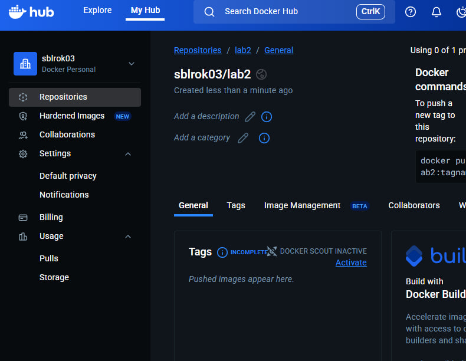
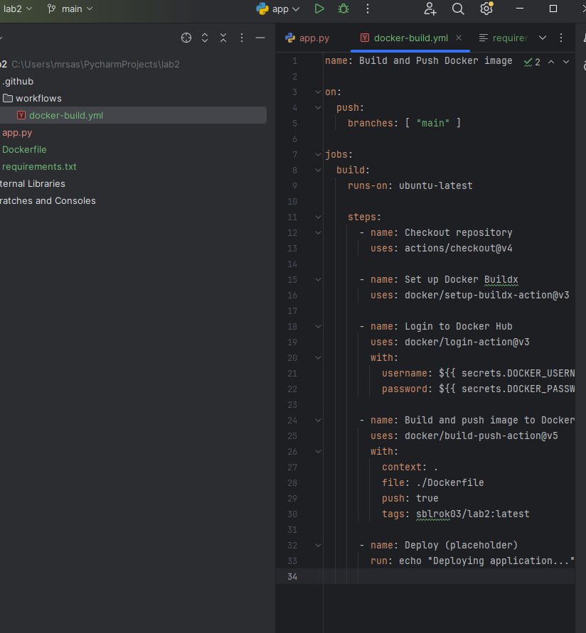
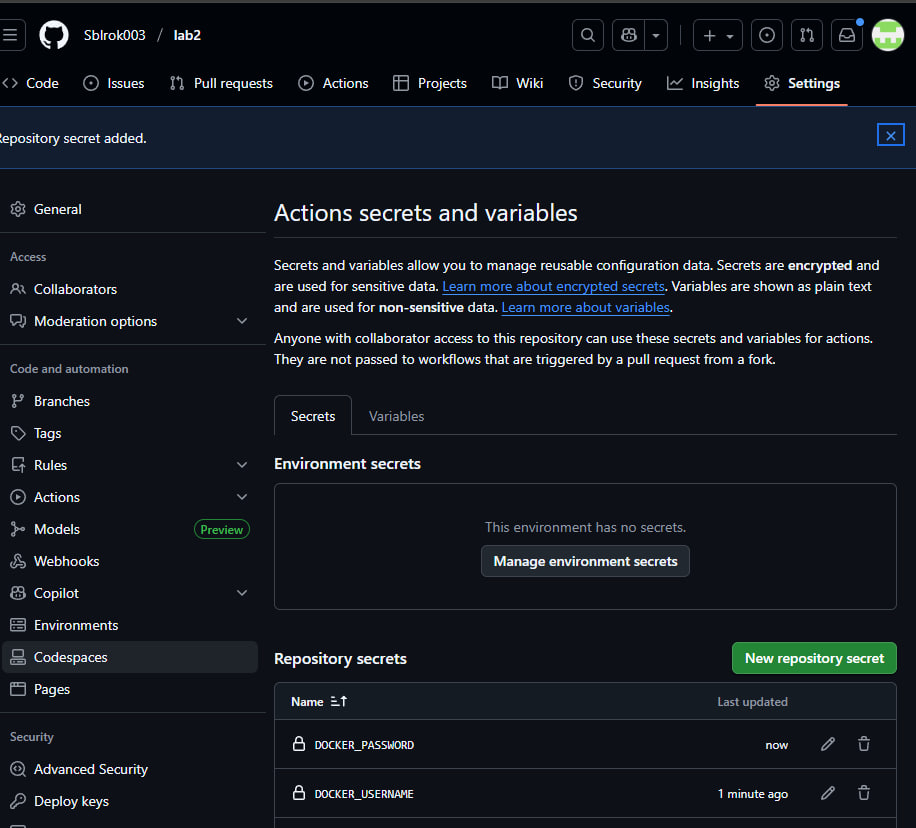
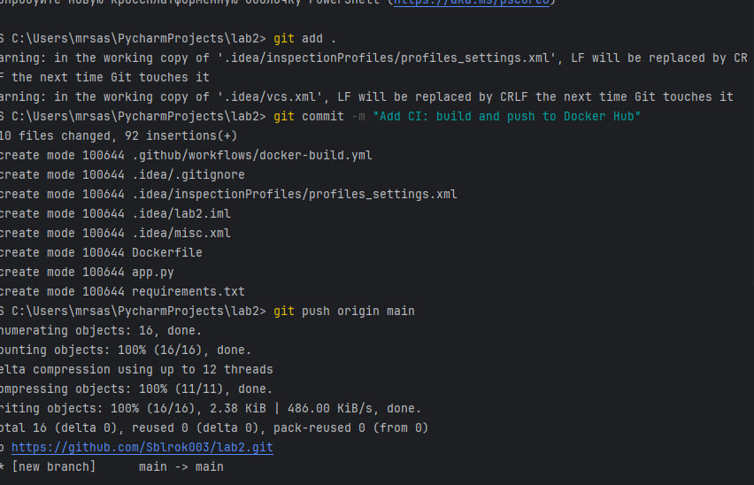
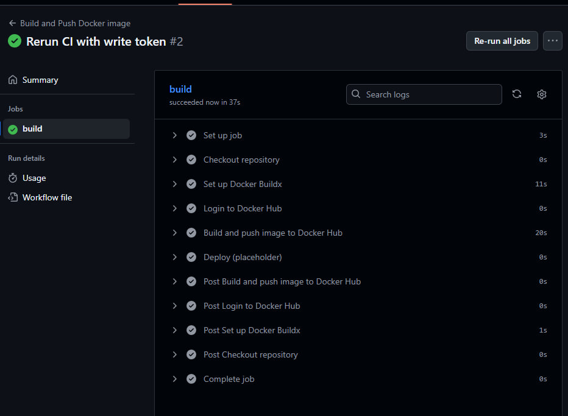
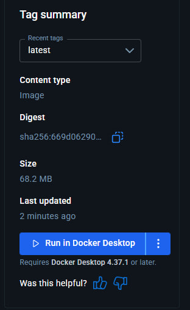
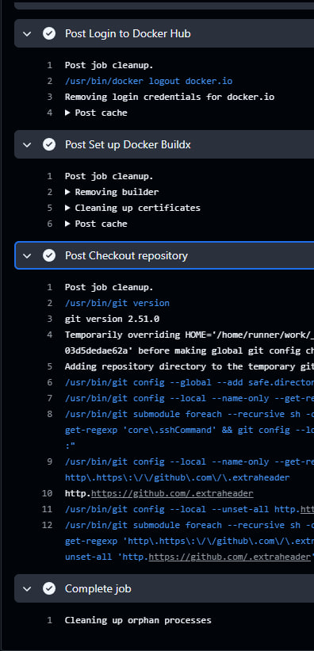

University: [ITMO University](https://itmo.ru/ru/)
Faculty: [FICT](https://fict.itmo.ru)
Course: [Cloud platforms as the basis of technology entrepreneurship](https://) ADD link
Year: 2025/2026
Group: U4225
Author: Budaev Alexandr Sayanovich
Lab: Lab2
Date of create: 10.10.2025
Date of finished: 10.10.2025

**Подготовка проекта**

1. Создал новый репозиторий GitHub:
https://github.com/sblrok03/lab2

2. Создал учётную запись в Docker Hub.
3. Создал новый репозиторий для образа:

**Настройка GitHub Actions**

1. В корне проекта создал папку .github/workflows/ 
2. Создал файл docker-build.yml со следующим пайплайном:
- Триггер: запуск при push в ветку main
- Runner: ubuntu-latest
- Действия:
  - Checkout репозитория
  - Настройка Docker Buildx
  - Логин в Docker Hub через секреты
  - Сборка и пуш образа с тегом sblrok03/lab2:latest
  - Шаг деплоя 

**Настройка секретов**
В настройках репозитория GitHub (Settings → Secrets → Actions) добавлены:
- DOCKER_USERNAME — sblrok03
- DOCKER_PASSWORD — токен доступа из Docker Hub (с правами Read & Write)

**Тестирование пайплайна**
1. Выполнил коммит и пуш в ветку main:

2. Проверил выполнение пайплайна в GitHub Actions:
- Все шаги прошли успешно
- Шаг Build and push image to Docker Hub выполнился без ошибок

3. Убедился, что образ появился в Docker Hub:
- Репозиторий: sblrok03/lab2
- Тег: latest
- Digest: sha256:669d06290...

4. Проверил логи выполнения каждого шага в Actions:
- Checkout 
- Login 
- Build & Push 
- Deploy 

