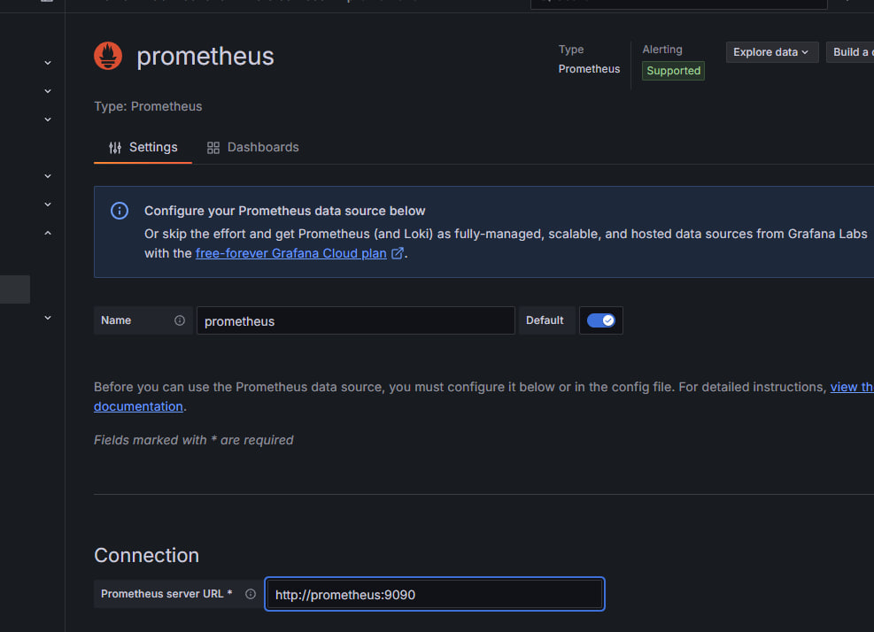

University: [ITMO University](https://itmo.ru/ru/)
Faculty: [FICT](https://fict.itmo.ru)
Course: [Cloud platforms as the basis of technology entrepreneurship](https://) ADD link
Year: 2025/2026
Group: U4225
Author: Budaev Alexandr Sayanovich
Lab: Lab3
Date of create: 12.10.2025
Date of finished: 12.10.2025 
 

1. Цель работы:

Научиться настраивать систему мониторинга с помощью Prometheus, Node Exporter и Grafana, собирать метрики и визуализировать их на дашбордах.

2. Используемые инструменты

Онлайн-платформа Play with Docker
Docker версии 27+
Prometheus, Node Exporter, Grafana
docker-compose

3. Ход выполнения работы

Шаг 1. Подготовка проекта

Создана рабочая папка:

Шаг 2. Конфигурация Prometheus
Создана структура:

Файл prometheus/prometheus.yml:

Шаг 3. Создание docker-compose.yml

Шаг 4. Запуск контейнеров
docker compose up -d

Проверка:
docker ps

✅ Запущенные контейнеры:

grafana/grafana

prom/prometheus

prom/node-exporter

Шаг 5. Проверка работы Prometheus

В Play with Docker открыт порт 9090.
Проверено, что сервисы prometheus и node-exporter находятся в статусе UP.

Шаг 6. Настройка Grafana
Перейдено на порт 3000
Авторизация:
логин: admin
пароль: admin

Добавлен источник данных Prometheus:
URL: http://prometheus:9090

Создан дашборд с метрикой:
node_cpu_seconds_total

4. Результаты

Развёрнут стек мониторинга Prometheus + Grafana + Node Exporter.
Prometheus собирает системные метрики.
Grafana визуализирует данные.
Все сервисы работают корректно в Docker окружении.

5. Вывод

В ходе работы изучены основы контейнерного мониторинга.
Настроена система сбора и визуализации метрик.
Получен навык работы с Prometheus и Grafana в Docker-среде без локальной установки.